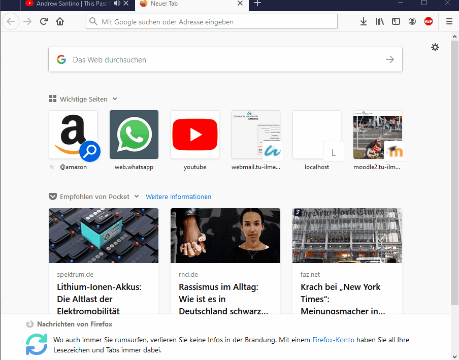

# Chat Manager
A basic chat management microservice.

## Access
(Locally the application runs on port `8040`).
Via docker-compose the application runs on port `9040`.

### Using Docker (starting via docker-compose)
This module should be started via docker-compose and is by default configured to run with Docker.

### Creating new chats
Before being able to access chats directly (in the browser) you need to create a group with at least one member (user).
As of now, this is only possible via Kafka; this module has consumers for "group" and "user".
Because of this, a user and a group have to be created in the user-manager and the group-manager first.

### Accessing the chat in the browser
After creating a user and a group, you can access the chat in the browser by going to http://localhost:9040/chat/<groupId>/<userId>.
 
 ### Demo 
 (outdated link shown in the browser)
 
 
 
 
 #### Accessing the database directly
  **PostgreSQL**
  
  When run using Docker, you can access the database by going to http://localhost:9002 in your browser. 
  The login data is:
  ```
  Datenbank System	PostgreSQL
  Server                  db
  Benutzer	        db_user
  Passwort	        db_pwd
  Datenbank	        postgres
  ```